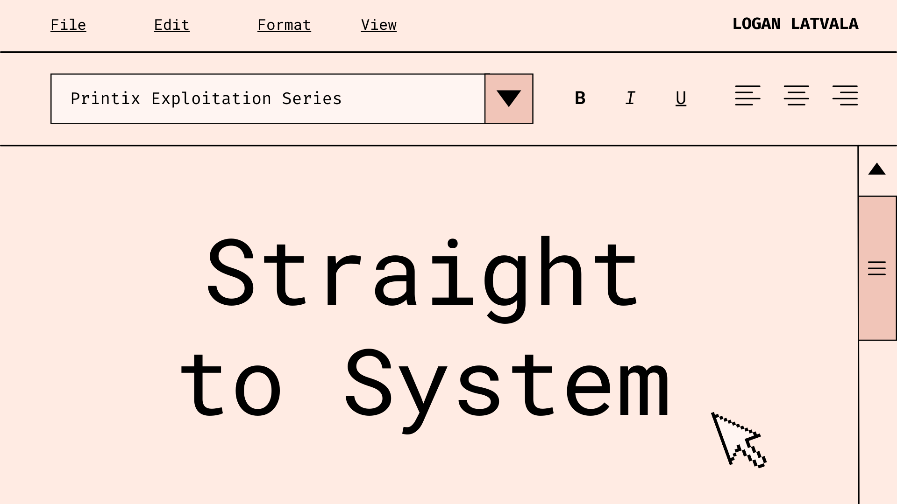

 

  

  <h3 align="center">CVE-2022-25090</h3>

  

    Instead of printing your homework as a user, print your system security policies as SYSTEM for fun. 
     
     
    <a href="https://github.com/ComparedArray/printix-CVE-2022-25090"><strong>Explore the docs »</strong></a>
     
     
    <a href="https://github.com/ComparedArray/printix-CVE-2022-25090">View Demo</a>
    .
    <a href="https://github.com/ComparedArray/printix-CVE-2022-25090/issues">Report Bug</a>
    .
    <a href="https://github.com/ComparedArray/printix-CVE-2022-25090/issues">Request Feature</a>
  

     

## Table Of Contents

* [About the Project](#about-the-project)
* [Built With](#built-with)
* [Getting Started](#getting-started)
  * [Prerequisites](#prerequisites)
  * [Installation](#installation)
* [Usage](#usage)
* [Roadmap](#roadmap)
* [Contributing](#contributing)
* [License](#license)
* [Authors](#authors)
* [Acknowledgements](#acknowledgements)

## About The Project

A "Creation of Temporary Files in Directory with Insecure Permissions" vulnerability in PrintixService.exe, in Printix's "Printix Secure Cloud Print Management", Version 1.3.1106.0 and below allows any logged in user to elevate any executable or file to the SYSTEM context. This is achieved by exploiting race conditions in the creation of the Installer's temp.ini file.

Here's why this is a big issue:

* Any account is capable of elevating a payload or executable to a SYSTEM context, so any user is able to bypass administrative restrictions.
* Any user logged in (regardless of their user role) is able to target a command file, and execute it as a system service. 
* AlwaysInstallElevated does not need to be enabled, as race conditions allow the Printix installer to elevate any payload provided.

Any machine that has any version of Printix installed (<= 1.3.1106.0 as of 3/1/2022) is highly vulnerable to this exploit. A patch could be released within a couple months, yet this may take even longer due to how embedded this command is inside their API, and how their entire authentication framework has to be changed.

This was discovered on 10/8/2021, and a CVE was reserved on 3/1/2022.

## Built With

.NET Framework 4.8

* [Visual Studio](https://visualstudio.microsoft.com/)

## Getting Started

There are two options to this project, such as compiling the solution yourself or just downloading and running the precompiled software.

### Prerequisites

You will need to install Visual Studio, or have downloaded the perquisite libraries.

### Installation

1. Download the project, and open it in Visual Studio.

2. Ensure that all NuGet packages are referenced.

3. Enjoy.

## Usage

This is a console based program, drag and drop your payload to execute it as SYSTEM Context. This tests race conditions, so if the installer is found and it tests race conditions, reset the program and try again.

If the installer is not found, you may edit the code to point to the installer in C:\Windows\Installer.

## Roadmap

See the [open issues](https://github.com/ComparedArray/printix-CVE-2022-25090/issues) for a list of proposed features (and known issues).

## Contributing

Contributions are what make the open source community such an amazing place to be learn, inspire, and create. Any contributions you make are **greatly appreciated**.
* If you have suggestions for adding or removing projects, feel free to [open an issue](https://github.com/ComparedArray/printix-CVE-2022-25090/issues/new) to discuss it, or directly create a pull request after you edit the *README.md* file with necessary changes.
* Please make sure you check your spelling and grammar.
* Create individual PR for each suggestion.
* Please also read through the [Code Of Conduct](https://github.com/ComparedArray/printix-CVE-2022-25090/blob/main/CODE_OF_CONDUCT.md) before posting your first idea as well.

### Creating A Pull Request

## License

Distributed under the MIT License. See [LICENSE](https://github.com/ComparedArray/printix-CVE-2022-25090/blob/main/LICENSE.md) for more information.

## Authors

* **Logan Latvala** - *Cyber security enthusiast* - [Logan Latvala](https://github.com/ComparedArray) - *Founded the vulnerability & created the code.*

## Acknowledgements

* [Mitre CVE-2022-25090](https://cve.mitre.org/cgi-bin/cvename.cgi?name=CVE-2022-25090)
* [Printix Software](https://printix.net)
* [NIST Institute](https://nist.gov)
* 
